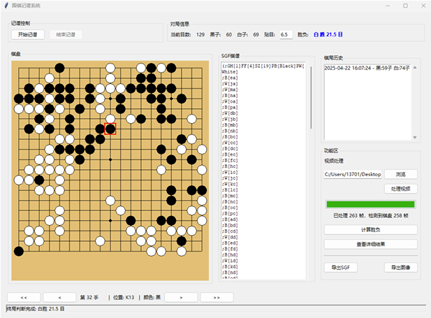
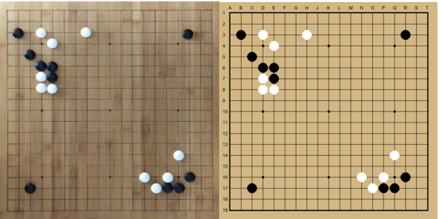

# 围棋棋盘识别与棋谱重建

[English](README.md) | 简体中文

这是一个从围棋对局视频中识别棋盘状态、重建对局并导出棋谱的计算机视觉桌面应用。项目将视频处理、棋盘透视校正、黑白棋子检测、19×19 网格映射和棋局状态追踪整合到同一流程中，支持导出 SGF 棋谱与重建棋盘图片。

本项目作为计算机科学本科毕业设计开发。

## 主要功能

- **桌面交互界面**：使用 Tkinter 展示重建棋盘、SGF 内容、落子记录和处理控制。
- **视频帧提取与筛选**：从视频中提取画面，根据稳定性筛选待识别帧。
- **棋盘透视校正**：对棋盘图像进行几何变换，为棋子定位与网格映射做准备。
- **黑白棋子检测**：使用基于 YOLO 的目标检测模型识别棋子位置和颜色。
- **网格映射与状态追踪**：将检测结果映射到 19×19 棋盘，记录棋盘状态变化。
- **可选手部遮挡过滤**：配置额外的手部检测模型后，可筛选含手部遮挡的画面。
- **结果导出**：生成 SGF 棋谱和数字棋盘图片，便于查看与复核。

## 处理流程

```text
输入对局视频 → 筛选稳定帧 → 棋盘透视校正 → 黑白棋子检测
→ 映射至 19×19 网格 → 追踪棋盘状态 → 导出 SGF / 棋盘图片
```

SGF（Smart Game Format）是一种用于保存棋局信息的文本格式。本项目将识别与重建结果导出为 `.sgf` 文件。

## 项目演示

### 桌面应用

界面在同一工作区展示重建棋盘、生成的 SGF 内容、落子历史和处理控制。



### 棋盘重建

程序将实物棋盘图像中的棋子位置映射到 19×19 数字棋盘。



## 技术组成

| 部分 | 技术与作用 |
|---|---|
| 应用语言 | Python |
| 桌面界面 | Tkinter |
| 图像与视频处理 | OpenCV |
| 棋子与手部检测 | Ultralytics YOLO、PyTorch |
| 数值与图像操作 | NumPy、SciPy、Pillow |
| 棋局输出 | SGF 文本、重建棋盘图片 |

## 仓库结构

```text
.
├── main.py                    应用入口
├── GUI.py                     Tkinter 桌面界面
├── GBR.py                     视频处理与棋局重建流程
├── Chess_Recognition/         棋子检测、网格映射、SGF 与棋局状态逻辑
├── Preprocess/                视频帧提取与棋盘透视校正
├── Test_Image/                示例图片
├── docs/assets/               项目演示截图
├── yaml/                      YOLO 模型结构实验配置
├── models/                    本地模型权重目录，权重文件未提交
└── requirements.txt           Python 依赖
```

## 安装与运行

### 1. 获取项目

```bash
git clone https://github.com/Yizhi-Q/go-board-recognition.git
cd go-board-recognition
```

### 2. 准备 Python 环境

建议使用 Python 3.10 或更高版本，并创建独立虚拟环境。以下以 macOS / Linux 为例：

```bash
python -m venv .venv
source .venv/bin/activate
python -m pip install -r requirements.txt
```

Windows 的虚拟环境激活命令取决于所用终端；例如在命令提示符中使用 `.venv\Scripts\activate.bat`，再安装上述依赖。

这是桌面应用，需要可用的图形界面和 Tkinter。程序在 CUDA 可用时使用 GPU，否则使用 CPU。

### 3. 准备模型权重

**模型权重未包含在仓库中。** 运行识别流程前，需要准备与项目检测接口兼容的模型文件，并放到以下位置：

| 文件路径 | 用途 | 是否必需 |
|---|---|---|
| `models/best_300epoch_onlybw.pt` | 黑白棋子检测 | 必需 |
| `models/hand_s.pt` | 手部遮挡检测 | 可选 |

未配置手部模型时，应用仍可运行，手部遮挡过滤功能不可用。更多说明见 [模型权重说明](models/README.md)。

### 4. 启动应用

在项目根目录运行：

```bash
python main.py
```

在界面中选择对局视频并执行处理，可查看棋盘重建、落子记录与 SGF 内容，并使用导出功能保存结果。

## 当前范围与说明

- 当前围绕 **19×19 围棋棋盘**开展识别和重建。
- 源代码注释和界面文字主要为中文，仓库提供中英文项目说明。
- 模型权重与生成的输出文件未纳入版本控制。
- `yaml/` 保存模型结构实验配置；这些配置本身不代表已经验证的准确率提升。复用或分发相关配置及权重时，应核对所涉及第三方组件的许可证。
- 仓库尚未提供公开的标注评测结果，演示截图不能替代棋子检测准确率或完整棋局重建准确率的评测。

## 后续完善方向

- 建立小规模带标注的评测集，分别报告棋子检测与棋盘状态识别准确率。
- 为网格映射、棋盘状态处理和 SGF 生成补充自动化测试。
- 补充简短演示视频，展示从视频输入到棋谱导出的完整操作过程。
